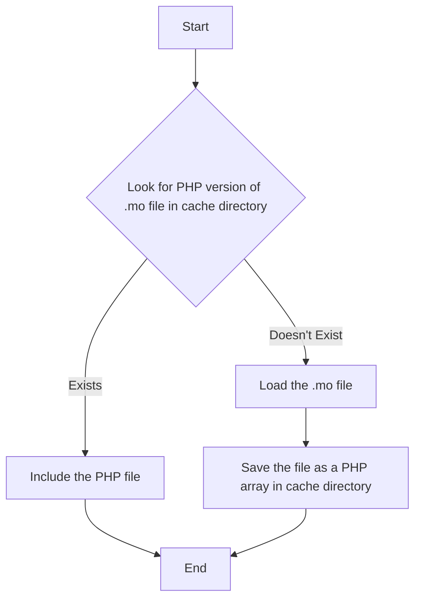

# A Faster load_textdomain

> **NOTE** This plugin is not needed if you are running WordPress 6.5 or later, as the functionality [is built into WordPress core](https://make.wordpress.org/core/2024/02/27/i18n-improvements-6-5-performant-translations/). If you need to generate translation in the new <code>.l10n.php</code> format, use the <a href="https://wordpress.org/plugins/performant-translations/">Performant Translations</a> plugin instead.

This is a WordPress plugin that caches the .mo file as an PHP array, and [include](https://www.php.net/manual/en/function.include.php) the array instead of the .mo file. In theory, nothing is faster in PHP than loading and executing another PHP file.

## Installation

Either (recommended):

- Download the plugin files and extract `a-faster-load-textdomain.php` and `class-afld-cachehandler.php` to the `wp-content/mu-plugins` directory.

Or:

- Search for "[A faster load_textdomain](https://wordpress.org/plugins/a-faster-load-textdomain/)" and install with the WordPress plugin installer.
- (Network) Activate the plugin through the 'Plugins' menu in WordPress.

It's also possible to install the plugin via Composer: `composer require soderlind/a-faster-load-textdomain`

## How It Works

If you have a plugin or theme that loads a textdomain, e.g. `load_textdomain( 'textdomain', $path_to_mo_file )`, then this plugin will:

1. Look for a PHP version of the .mo file in `WP_CONTENT_DIR . '/cache/a-faster-load-textdomain'` directory.
2. If the PHP version exists, [include](https://www.php.net/manual/en/function.include.php) the file.
3. If the PHP version doesn't exist, load the .mo file, and save the file as an PHP array in `wp-content/cache/a-faster-load-textdomain/` directory.



The localized PHP array can be cached via [PHP OPcache](http://blog.jpauli.tech/2015-03-05-opcache-html/). If you have PHP OPcache enabled, then the localized PHP array will be cached in memory, and the PHP file will not be parsed again.

## Filters

### `a_faster_load_textdomain_cache_path`

Change the cache path, default is `WP_CONTENT_DIR . '/cache/a-faster-load-textdomain'`.

```php
add_filter( 'a_faster_load_textdomain_cache_path', function( $path ) {
	return WP_CONTENT_DIR . '/cache/my-cache';
} );
```

## Changelog

See [CHANGELOG.md](CHANGELOG.md).

## Credits

Orignal file: https://github.com/lynt-smitka/WP-nginx-config/blob/master/extras/mu-plugins/lynt-mo-cache.php

## Copyright and License

This plugin is copyright © 2023 [Per Soderlind](http://soderlind.no).

This plugin is free software; you can redistribute it and/or modify it under the terms of the GNU General Public License, version 2, as published by the Free Software Foundation.

This program is distributed in the hope that it will be useful, but WITHOUT ANY WARRANTY; without even the implied warranty of MERCHANTABILITY or FITNESS FOR A PARTICULAR PURPOSE. See [LICENSE](LICENSE) for more information.
